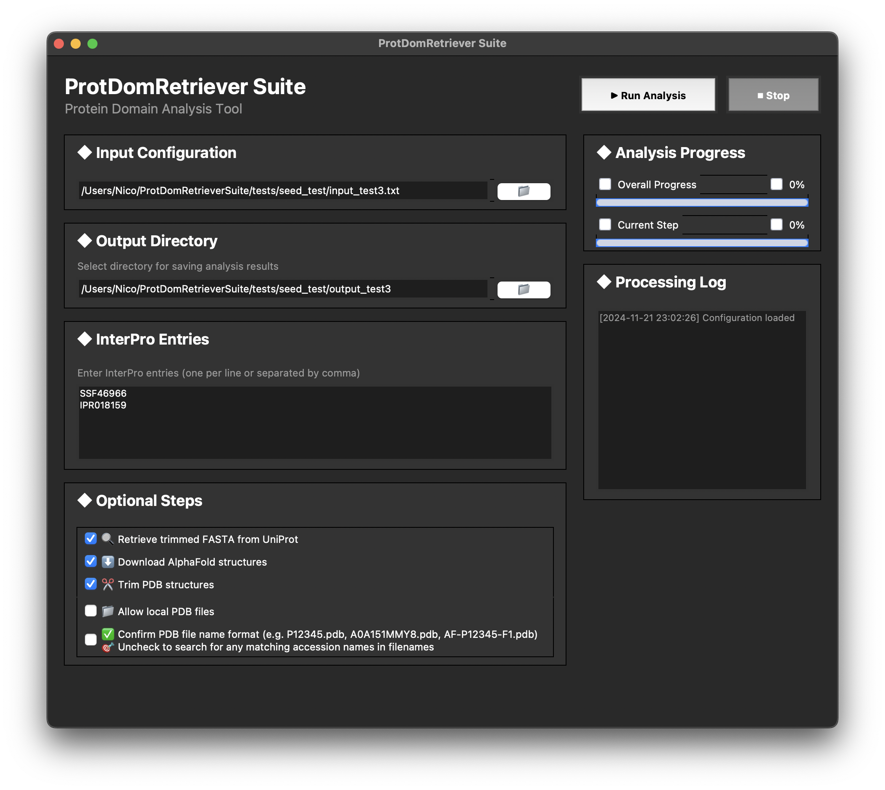

# ProtDomRetrieverSuite

<div align="center">
  
  
  
</div>

**Created by Nicolas-Frédéric Lipp, PhD**

ProtDomRetrieverSuite builds on ProtDomRetriever, adding a comprehensive graphical interface and extended functionality for protein domain analysis. It retains core features, such as retrieving domain information from InterPro, while introducing support for AlphaFold structure downloads and domain-specific PDB structure processing.

---

## Illustrations

<div align="center">
  
  
</div>

- **ProtDomRetriever Illustration (left):** A visual representation of ProtDomRetrieverSuite’s functionality, generated using AI tools. The exact AI prompt is available in `assets/ai_prompt_example.txt`.
- **GUI Screenshot (right):** An example of the graphical user interface of ProtDomRetrieverSuite, illustrating the input configuration, optional steps, and progress tracking.

---

## Table of Contents
1. [Features](#features)
2. [Quick Installation](#quick-installation)
3. [Usage](#usage)
4. [Examples](#examples)
5. [Support](#support)
6. [License](#license)
7. [Acknowledgments](#acknowledgments)
8. [Development Notes](#development-notes)

---
<div align="center">

### Keywords
**Protein Domain Analysis** • **Bioinformatics Tools** • **InterPro** • **UniProt** • **AlphaFold** • **Structural Bioinformatics**
</div>

## Features

### Core Features (from ProtDomRetriever)
- Retrieve domain information for multiple UniProtKB accessions
- Filter domains based on specified InterPro entries
- Select longest domains when multiple entries overlap
- Generate TSV output with domain ranges
- Create FASTA files for the retrieved protein domains

### New Features
- Modern-like graphical user interface with dark mode
- Real-time progress tracking and logging
- AlphaFold structure download integration
- PDB structure trimming based on domain ranges
- Improved error handling and recovery
- Multi-threaded processing for better performance

## System Requirements

### Hardware Requirements
- Display resolution: Minimum 870x800 pixels
- RAM: 4GB minimum (≥ 8GB recommended for large datasets)
- Storage: Space requirements depend on dataset size and features used:
  - Basic analysis: < 100MB
  - With AlphaFold/PDB structures: ~300KB per structure
  - With trimmed structures: additional ~300KB per structure

### Software Requirements
- Python 3.8 or newer
- Internet connection for API access (InterPro, UniProt, AlphaFold)
- Graphics system capable of supporting tkinter GUI

### Operating Systems
- macOS (Sequoia 15.0+ supported)
- Linux
- Windows

## Quick Installation
To get started, make sure you have **Python 3.8+** installed. You can install ProtDomRetrieverSuite in two ways:

### Option 1: Direct Installation from GitHub
```bash
pip install git+https://github.com/NicoFrL/protdomretrieversuite.git
```
### Option 2: Local Installation

```bash
# Clone the repository
git clone https://github.com/NicoFrL/protdomretrieversuite.git

# Navigate to the cloned repository
cd protdomretrieversuite

# Install the package using pip
pip install .
```

For detailed installation instructions, including system-specific setup and troubleshooting, see [INSTALL.md](INSTALL.md).

### Note for macOS Users (macOS Sequoia 15.0+)
If you're using macOS Sequoia, you might see messages in the terminal like:
```
"Python[XXXXX:XXXXX] +[IMKInputSession subclass]: chose IMKInputSession_Legacy"
```
This is a diagnostic message from macOS Sequoia's input method system. It is harmless, does not affect functionality, and can be safely ignored.

### Configuration
The application automatically saves your last used configuration (input/output paths, selected options) to `config.json` and restores it on next launch for a smoother workflow.

## Quick Start
1. Launch the application: `protdomretrieversuite`
2. Select example input from `tests/seed_test/input_test1.txt`
3. Enter example entries from `tests/seed_test/entries_test1.txt`
4. Choose an output directory and Press "▶ Run Analysis"! 

## Usage

    **[InterPro](https://www.ebi.ac.uk/training/online/courses/interpro-functional-and-structural-analysis/what-is-an-interpro-entry/interpro-entry-types/)** (e.g., `IPR000001`)  
    **[CATH-Gene3D](https://www.cathdb.info)** (e.g., `G3DSA:1.10.10.10`)  
    **[CDD](https://www.ncbi.nlm.nih.gov/cdd/)** (e.g., `cd00001`)  
    **[HAMAP](https://hamap.expasy.org)** (e.g., `MF_00001`)  
    **[PANTHER](https://pantherdb.org)** (e.g., `PTHR10000`)  
    **[Pfam](http://pfam.xfam.org)** (e.g., `PF00001`)  
    **[PIRSF](https://proteininformationresource.org/pirsf/)** (e.g., `PIRSF000005`)  
    **[PRINTS](https://interpro-documentation.readthedocs.io/en/latest/prints.html)** (e.g., `PR00001`)  
    **[PROSITE Patterns](https://prosite.expasy.org)** (e.g., `PS00001`)  
    **[PROSITE Profiles](https://prosite.expasy.org)** (e.g., `PS01031`)  
    **[SMART](http://smart.embl-heidelberg.de)** (e.g., `SM00002`)  
    **[SFLD](http://sfld.rbvi.ucsf.edu/archive/django/index.html)** (e.g., `SFLDF00001`)  
    **[SUPERFAMILY](https://supfam.org/SUPERFAMILY/)** (e.g., `SSF100879`)  
    **[NCBIfam](https://www.ncbi.nlm.nih.gov/genome/annotation_prok/evidence/)** (e.g., `NF000124`)  


For more information about Protein Classification (family, domain, sequence feature) and Protein Signatures (patterns, profiles, fingerprints, hidden Markov models (HMMs)), [please visit EMBL-EBI tutorial](https://www.ebi.ac.uk/training/online/courses/protein-classification-intro-ebi-resources/protein-classification/why-classify-proteins/).

### Starting the Application
```bash
protdomretrieversuite
```
### Using the Interface
1. Select an input file containing UniProtKB accessions (one per line)
    ```
    # Example input file:
        Q02201
        P12345
        ```
2. Choose output directory for results (wherever you want on your computer)
3. Enter InterPro entries for domain filtering (as indicated, one per line or separated by comma)
    ```
    # Example InterPro entries:
    IPR018159
    SSF46966
    # or
    IPR018159, SSF46966
    ```
4. Select optional processing steps:
   - FASTA sequence retrieval
        ### Download one Fasta File with domain positions in the headers
   - AlphaFold structure download
   - PDB structure trimming

### Output Files

The suite generates several output files, depending on the selected options:

| File Name                | Description                                                                           |
|--------------------------|---------------------------------------------------------------------------------------|
| `domain_analysis.tsv`    | Comprehensive domain information for all input proteins in a tab-separated file.      |
| `domain_ranges.txt`      | Text file listing the start and end ranges of the detected domains.                   |
| `domain_sequences.fasta` | Contains FASTA sequences of domains if the retrieval option is enabled.               |
| `alphafold_structures/`  | A directory storing AlphaFold-predicted structures downloaded during analysis.        |
| `trimmed_structures/`    | Stores PDB files trimmed to match the specific domain ranges.                         |
| `trimming_summary.json`  | Trimming info, including timestamps, sources, number processed files and their paths. | 
   
## Performance Notes
- Multi-threaded processing for efficient API requests
- Rate limiting implemented to respect API guidelines
- Memory usage scales with input size
- For large datasets (>1000 proteins), consider:
  - Breaking input into smaller batches
  - Ensuring stable internet connection
  - Having sufficient disk space for structure files
   
## Examples
Example datasets are provided in the `tests` directory:
1. Test Dataset 1 (`input_test1.txt`, `entries_test1.txt`)
2. Test Dataset 2 (`input_test2.txt`, `entries_test2.txt`)
3. Test Dataset 3 (`input_test3.txt`, `entries_test3.txt`)


## Support
If you encounter any issues or have questions, you can:
1. Check the log files in your output directory for detailed debugging information.
2. Open an issue on the [GitHub repository](https://github.com/NicoFrL/ProtDomRetrieverSuite/issues).
3. Contact the developer directly through [GitHub](https://github.com/NicoFrL).

## Author
Nicolas-Frédéric Lipp, PhD  
https://github.com/NicoFrL

## License
This project is distributed under **a Custom Academic and Non-Commercial License**.  
It is free to use for educational, research, and non-profit purposes.  
For commercial use, please refer to the [LICENSE](./LICENSE) file or contact the author for more information.

## Acknowledgments

- [InterPro database and API](https://interpro-documentation.readthedocs.io/en/latest/interpro.html)  
    Includes [rate limiting guidelines](https://interpro-documentation.readthedocs.io/en/latest/faq.html) and [API details on GitHub](https://github.com/ProteinsWebTeam/interpro7-api/tree/master/docs).  
- [AlphaFold DB](https://alphafold.ebi.ac.uk/about)  
  Provides access to predicted protein structures with [API documentation](https://alphafold.ebi.ac.uk/api-docs).  
- [UniProt database](https://www.uniprot.org/help/about)  
  Comprehensive protein information with [programmatic access details](https://www.uniprot.org/help/programmatic_access).


## Development Notes
This project was developed with assistance from AI language models to enhance code structure, adhere to best practices, and improve documentation. The scientific approach and core algorithm were entirely designed and implemented by the author.
